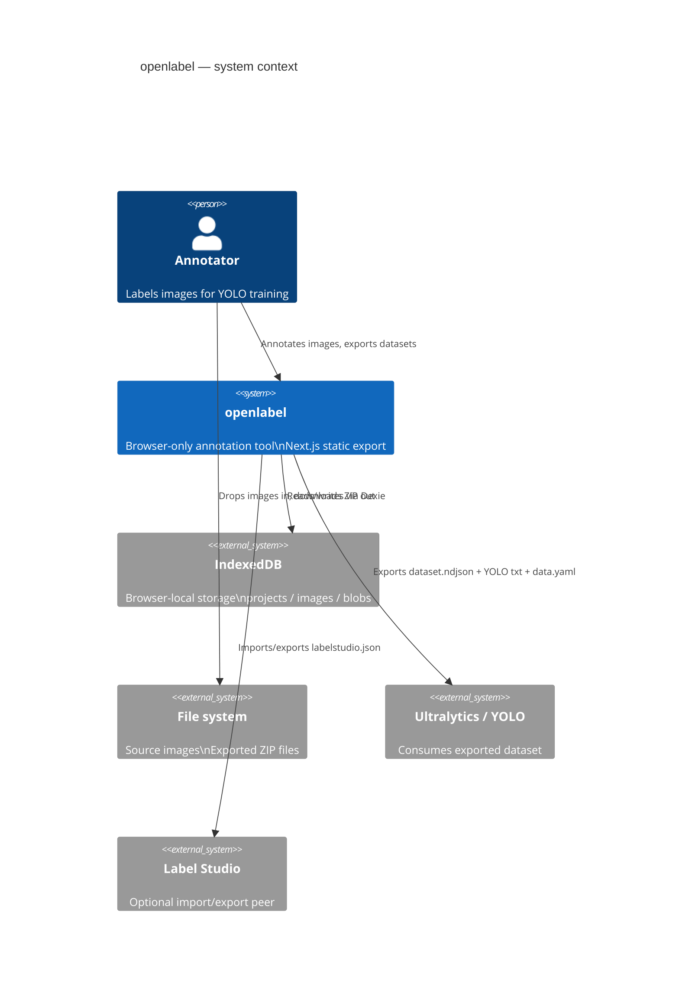
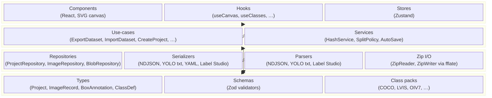
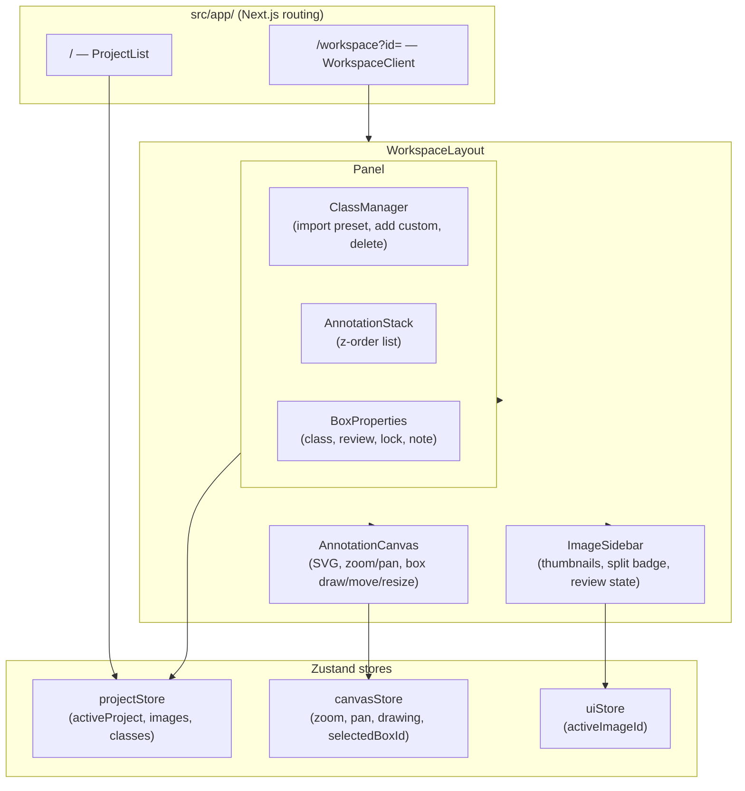
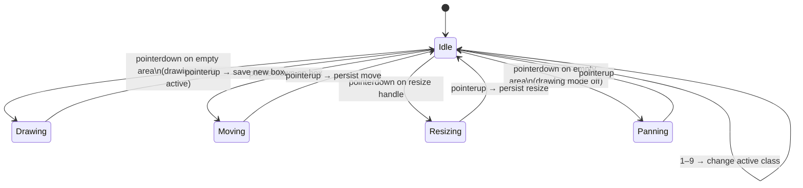
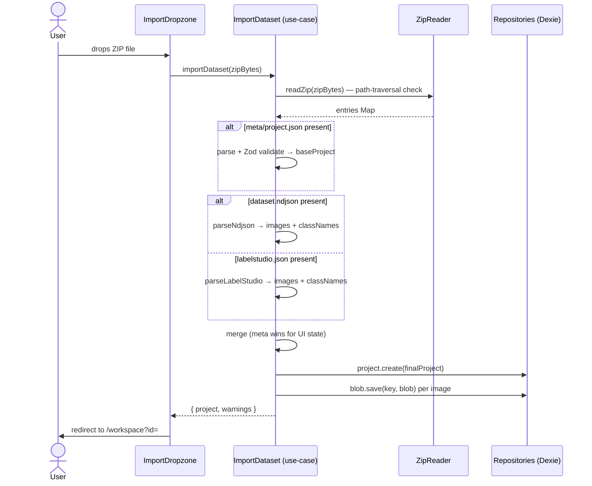
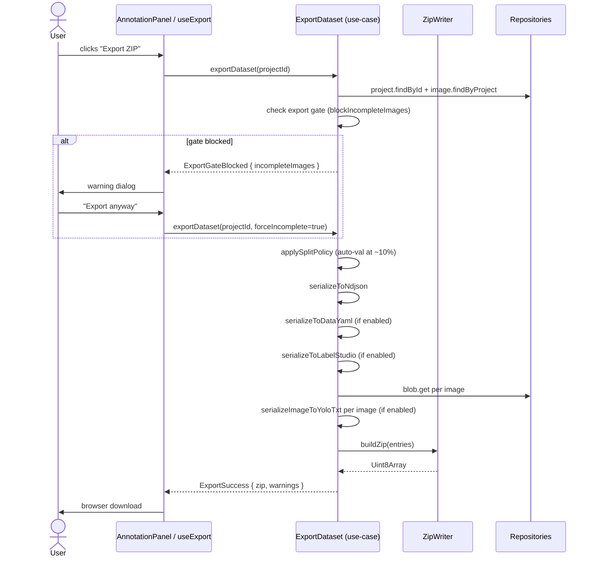

# Architecture

openlabel is a static SPA with zero backend. Everything runs in the browser; data lives in IndexedDB.

---

## System context



---

## Clean Architecture layers



**Dependency rule:** arrows point inward only. Domain imports nothing from infra or UI.

---

## Component map



---

## Annotation canvas interaction state machine



---

## Import flow



---

## Export flow



---

## Folder layout

```
/
├── src/                          business repo root (Next.js src/ convention)
│   ├── app/                      Next.js App Router (routing only)
│   │   ├── page.tsx              → ProjectList
│   │   └── workspace/
│   │       ├── page.tsx
│   │       └── WorkspaceClient.tsx   → full annotation workspace
│   │
│   ├── common/
│   │   ├── domain/
│   │   │   ├── annotations/      BoxAnnotation, review states
│   │   │   ├── classes/          ClassDef, CLASS_PACKS registry, all packs
│   │   │   └── dataset/          Project, ImageRecord, ExportOptions, Zod schemas
│   │   ├── application/
│   │   │   ├── use-cases/        CreateProject, ExportDataset, ImportDataset, …
│   │   │   └── services/         HashService, SplitPolicy
│   │   └── infrastructure/
│   │       ├── parsers/          NdjsonParser, LabelStudioParser, YoloTxtParser
│   │       ├── persistence/      Dexie db, ProjectRepository, ImageRepository, BlobRepository
│   │       ├── serializers/      NdjsonSerializer, YoloTxtSerializer, YamlSerializer, LabelStudioSerializer
│   │       └── zip/              ZipReader (path-traversal protected), ZipWriter
│   └── ui/
│       ├── components/           AnnotationCanvas, AnnotationPanel, ImageSidebar, …
│       ├── hoc/                  withClientOnly, withErrorBoundary
│       ├── hooks/                useCanvas, useClasses, useAnnotations, …
│       ├── layouts/              WorkspaceLayout
│       └── stores/               projectStore, canvasStore, uiStore
│
├── tests/
│   ├── unit/                     Vitest — serializers, parsers, use-cases
│   ├── integration/              Vitest + fake-indexeddb — repositories
│   └── e2e/                      Playwright — full annotation flow
│
├── docs/
│   ├── README.md                 ← you are here
│   ├── architecture.md
│   ├── data-model.md
│   ├── export-contract.md
│   └── adr/
│
├── infra/
│   └── hosting/
│
└── tsconfig.json                 @/* → ./src/*
```

> **Path alias:** `@/*` maps to `./src/*` in both `tsconfig.json` and `vitest.config.ts`.
> There are no `@/app/...` imports — intra-`src/app/` references use relative paths.
