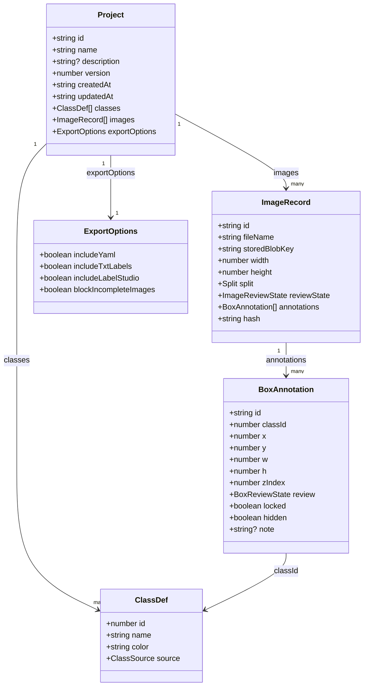
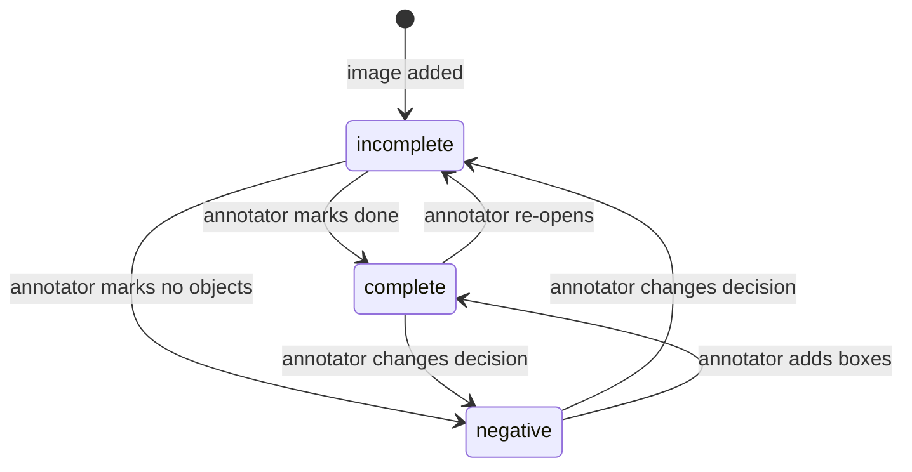
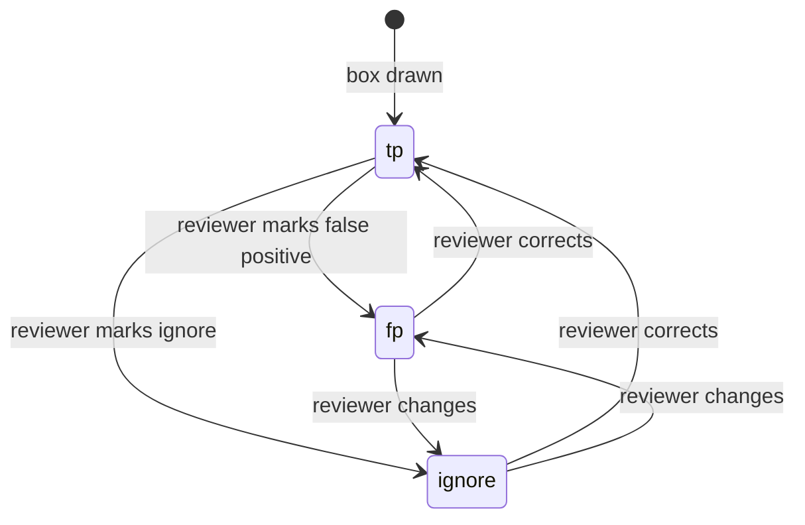
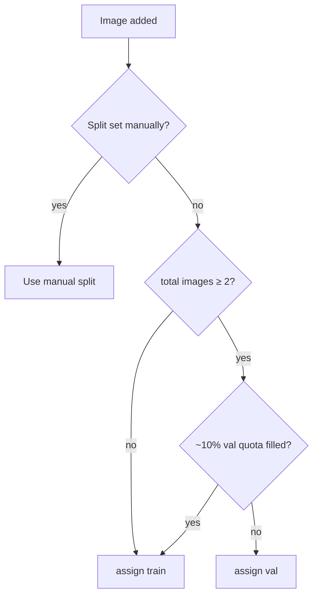
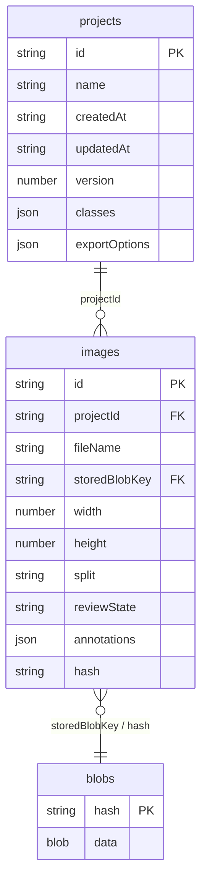

# Data model

---

## Domain types

**Coordinate system:** `x`, `y`, `w`, `h` are normalized to `[0, 1]` in YOLO center format.
`x` and `y` are the center of the box, not the top-left corner.

---

## Review state machines

### Image review state

### Box review state

Only `tp` boxes appear in `dataset.ndjson` and YOLO txt labels.
`fp` and `ignore` are preserved in `meta/project.json` for review traceability but never enter training data.

---

## Split assignment

`test` split is never auto-assigned — only set manually per image.

---

## Class pack registry

```mermaid
graph LR
    subgraph Registry["CLASS_PACKS array"]
        P1["COCO-80 (80)"]
        P2["VOC-20 (20)"]
        P3["Objects365 (365)"]
        P4["Open Images V7 (601)"]
        P5["LVIS (1203)"]
        P6["VisDrone-10 (10)"]
        P7["xView-60 (60)"]
        P8["Global Wheat (1)"]
        P9["Brain Tumor (2)"]
        P10["African Wildlife (4)"]
        P11["Signature (1)"]
        P12["Medical Pills (1)"]
    end

    subgraph Map["CLASS_PACK_REGISTRY Map"]
        K["id → ClassDef[]"]
    end

    subgraph UI["ClassManager component"]
        D["Import preset dropdown"]
    end

    Registry --> Map
    Map --> UI

    style P5 fill:#2a1a4e,color:#ccc
    style P4 fill:#1a2a4e,color:#ccc
    style P3 fill:#1a3a2e,color:#ccc
```

Colors for packs with more than 20 classes are generated via golden-angle HSL rotation
(`h = (i × 137.508) mod 360`) to guarantee maximum visual separation regardless of palette size.

---

## IndexedDB schema (Dexie)

`blobs` are content-addressed by SHA-256 hash. Uploading the same image twice stores it once.
Deleting a project removes blobs that are no longer referenced by any other project.
