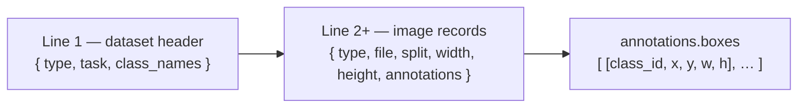
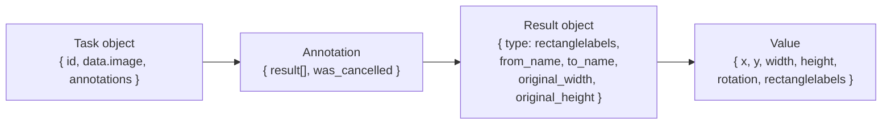
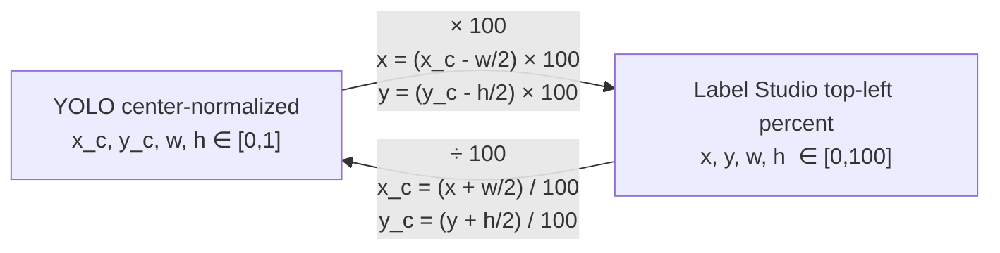
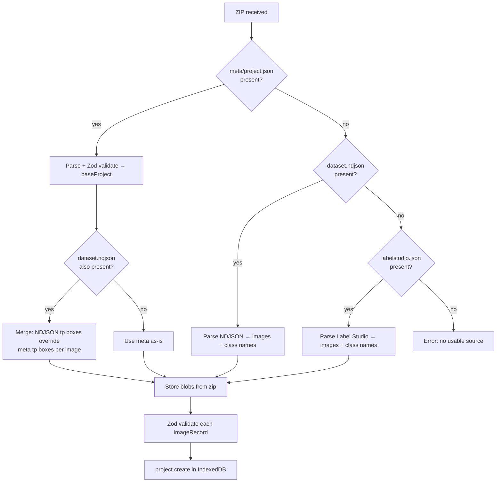

# Export contract

This document is the authoritative spec for the openlabel zip format.
Serializers, parsers, and tests must all agree with what is written here.

---

## Zip structure

```
dataset-annotation-app-export.zip
├── dataset.ndjson            ← canonical training format (always present)
├── data.yaml                 ← Ultralytics YOLO config (opt-in)
├── images/
│   ├── train/
│   ├── val/
│   └── test/                 ← only present if any image has split=test
├── labels/
│   ├── train/
│   ├── val/
│   └── test/                 ← YOLO txt, one file per image (opt-in)
├── labelstudio.json          ← Label Studio JSON (opt-in)
└── meta/
    └── project.json          ← round-trip UI metadata (always present)
```

---

## dataset.ndjson



### Dataset header (line 1)

```json
{
  "type": "dataset",
  "task": "detect",
  "class_names": ["person", "car", "bicycle"]
}
```

- `class_names` is ordered by `ClassDef.id` (zero-indexed, stable within a project).

### Image record (lines 2+)

```json
{
  "type": "image",
  "file": "frame_001.jpg",
  "split": "train",
  "width": 1920,
  "height": 1080,
  "annotations": {
    "boxes": [
      [0, 0.512, 0.340, 0.210, 0.430],
      [1, 0.820, 0.650, 0.090, 0.120]
    ]
  }
}
```

- `boxes` format: `[class_id, x_center, y_center, width, height]` — all normalized `[0, 1]`.
- **Only `tp` boxes are exported.** `fp` and `ignore` boxes are never included.
- Negative image (no tp boxes): `"annotations": { "boxes": [] }`.
- No UI-only fields (`zIndex`, `review`, `color`, `locked`, `hidden`) appear here.

---

## data.yaml

```yaml
path: .
train: images/train
val: images/val
test: images/test       # omitted if no test split

nc: 3
names:
  0: person
  1: car
  2: bicycle
```

`test` key is omitted when no images have `split=test`.

---

## YOLO txt labels

One file per image at `labels/{split}/{stem}.txt`. Each line is one `tp` box:

```
0 0.512 0.340 0.210 0.430
1 0.820 0.650 0.090 0.120
```

Format: `class_id x_center y_center width height` (space-separated, normalized).
Negative images get an empty file (zero bytes).

---

## labelstudio.json

Optional. Enabled via `ExportOptions.includeLabelStudio = true`.



```json
[
  {
    "id": 1,
    "data": { "image": "frame_001.jpg" },
    "annotations": [{
      "result": [{
        "from_name": "label",
        "to_name": "image",
        "type": "rectanglelabels",
        "value": {
          "x": 40.7, "y": 12.5, "width": 21.0, "height": 43.0,
          "rotation": 0,
          "rectanglelabels": ["person"]
        },
        "original_width": 1920,
        "original_height": 1080,
        "image_rotation": 0
      }],
      "was_cancelled": false
    }]
  }
]
```

**Coordinate system:** `x`, `y`, `width`, `height` are percentages `[0, 100]` of image dimensions.
`x` and `y` are the **top-left** corner (not center — unlike YOLO format).

### Conversion between formats



---

## meta/project.json

Full `Project` object serialized as JSON. Contains:
- All `ImageRecord` fields including `reviewState`, `hash`, `storedBlobKey`
- All `BoxAnnotation` fields including `review`, `zIndex`, `locked`, `hidden`, `note`
- `ClassDef` colors and `source`
- `ExportOptions`

This file is the highest-priority source during re-import. If present, it wins over `dataset.ndjson` for UI state.

---

## Import priority



---

## Security rules for import

- All zip paths are normalized before extraction — `../` traversal, Windows reserved names, null bytes, and leading `/` are all rejected.
- Per-file size limit: 10 MB.
- Total zip size limit: 2 GB.
- All NDJSON lines and Label Studio tasks are validated against Zod schemas before mutating state.
- Invalid lines are skipped with a warning; they do not abort the import.
- Remote URLs found inside imported files are never auto-fetched.
